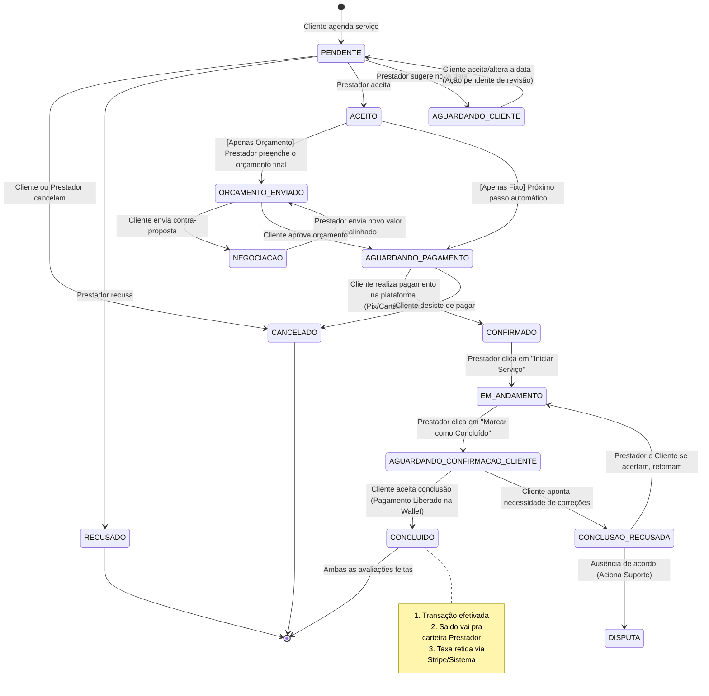

# Fluxograma de Operações - Agendamentos WhoDo

Este diagrama mapeia todas as etapas, desde a criação do agendamento pelo cliente, as transações envolvidas e negociações, até a resolução (pagamento liberado e avaliação). 

---

## 🔍 Análise: "Esquecemos algo no processo?"

Olhando estruturalmente para tudo que implementamos nas rotas até aqui, **95% do fluxo central (Caminho Feliz e Cancela) está perfeito**. Porém, aqui estão alguns pontos cegos (Edge Cases) que identificamos ao criar este fluxograma:

### 1. Aceitar Sugestão de Data (Status `AGUARDANDO_CLIENTE`)
- **Situação:** Ao propor uma nova data, mandamos a proposta para o chat e mudamos o status para `aguardando_cliente` ou propomos direto no modal de "Sugerir Data". 
- **O que falta:** O cliente precisa de um botão para "Aceitar nova data" que atualizaria a `data_agendamento` oficial e mudaria o status para `aceito` ou `pendente`. Hoje, temos a ação do Prestador sugerir, mas não a do Cliente de *confirmar* essa sugestão.

### 2. Disputa / Mediação (`DISPUTA`)
- **Situação:** Se um serviço fica preso como "Conclusão Recusada" pelo cliente, o dinheiro do cliente já está com a WhoDo (confiado no sistema). Se o prestador não conseguir corrigir o problema, o agendamento fica travado num limbo infinito?
- **O que falta:** Ter um botão ou ação após X dias de status `conclusao_recusada` para encaminhar para **"Em Disputa"**. Onde o administrador ou o suporte decida o devolução à carteira do cliente de certa porcentagem do serviço.

### 3. Expirar Agendamento Automático
- **Situação:** Se o prestador ignorar e nunca aceitar, ou o cliente for gerado um link de pagamento mas nunca pagar a fatura e o horário do atendimento passar.
- **O que falta:** Criar um "CRON JOB" ou lógica de verificação futura onde agendamentos `pendentes` com data < "hj - 2 horas" viram automaticamente `cancelado` alegando "Tempo expirou", limpando assim o slot na disponibilidade do calendário.

### 4. Fluxo de Avaliação Interdependente
- O fluxo de pagamento manda um alerta de notificação para que **ambos avaliem**, mas não condiciona nada do ciclo de pagamento a essa avaliação, então está perfeito e independente! 

Você gostaria de implementar a correção do **Ponto 1 (Cliente confirmar sugestão de data)** no painel de botões do cliente agora para fechar esse cerco?
